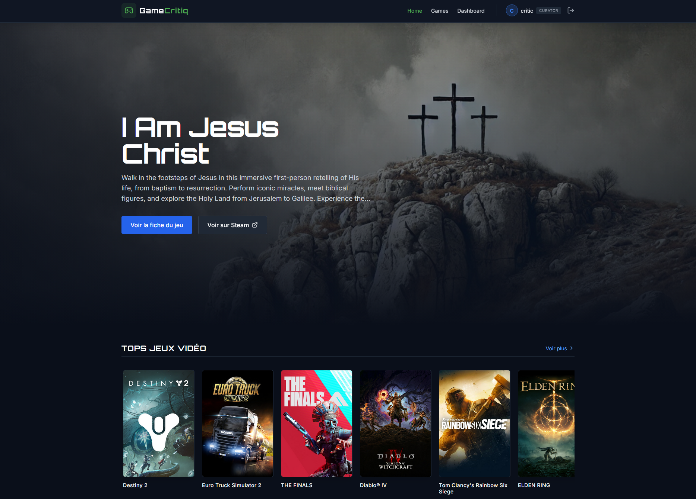

# Projet web 2026



## Folders

- `.husky` - git hooks
- `.vscode` - editor configs
- `apps` - application code
  - `client` - react frontend
  - `api` - express backend
  - `scrap-steam` - helper to scrap a list of game from steam

## Installation

Install [pnpm](https://pnpm.io/) and Docker

### Dependencies

```sh
pnpm i
```

### Environment variables

```sh
cp .env.example .env
cp ./apps/api/.env.example ./apps/api/.env
```

## Development

Start the database with docker:

```sh
pnpm docker
```

Start the api and client in parallel:

```sh
pnpm dev
```

### Client only

```sh
pnpm --filter client dev
```

### Api only

Running the api require an instance of Postgres, the easiest is to run it using docker.

```sh
pnpm docker
```

```sh
pnpm --filter api dev
```

## Build

```sh
pnpm build
```
