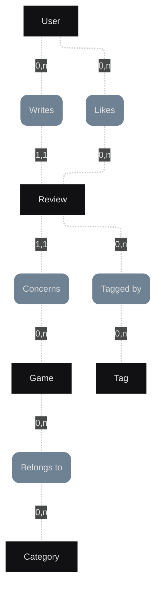
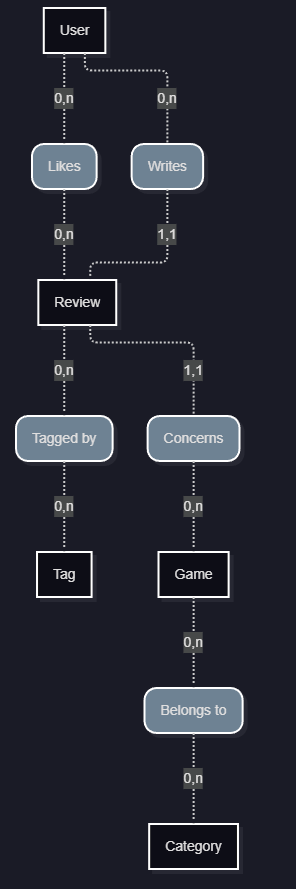

# CDM

```mermaid
---
config:
  layout: elk
  theme: redux-dark
---
flowchart TD
    User
    Review
    Game
    Tag
    Category

    User -. 0,n -.- UserReviews("Writes") -. 1,1 -.- Review
    User -. 0,n -.- UserLikes("Likes") -. 0,n -.- Review
    Review -. 1,1 -.- GameReviews("Concerns") -. 0,n -.- Game
    Review -. 0,n -.- ReviewTags("Tagged by") -. 0,n -.- Tag
    Game -. 0,n -.- GameCategories("Belongs to") -. 0,n -.- Category


    UserReviews:::actions
    GameReviews:::actions
    ReviewTags:::actions
    GameCategories:::actions
    UserLikes:::actions

    classDef actions fill:#6e8293
```

