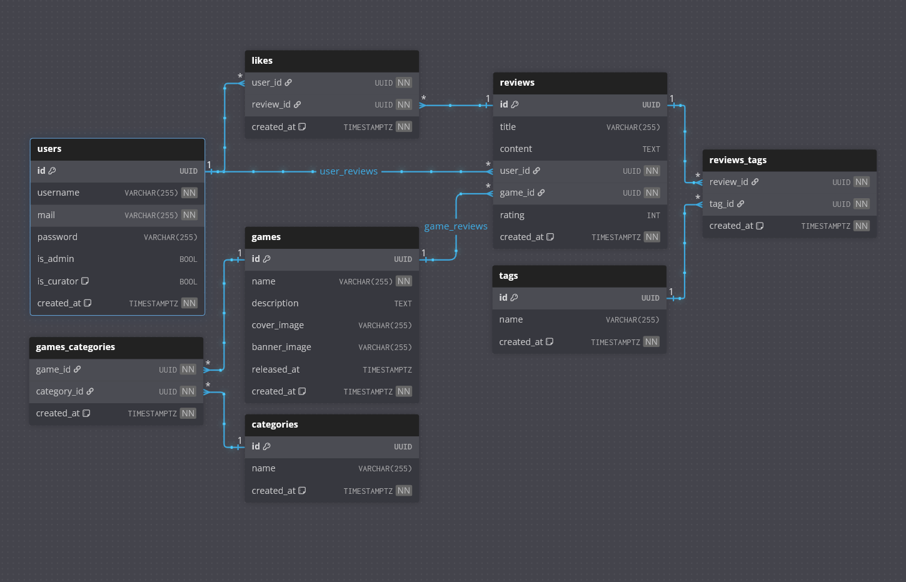

# LDM

```dbml
Table tags {
  id UUID [pk]
  name VARCHAR(255)
  created_at TIMESTAMPTZ [not null, default: `CURRENT_TIMESTAMP`]
}

Table categories {
  id UUID [pk]
  name VARCHAR(255)
  created_at TIMESTAMPTZ [not null, default: `CURRENT_TIMESTAMP`]
}

Table games {
  id UUID [pk]
  name VARCHAR(255) [not null]
  description TEXT
  cover_image VARCHAR(255)
  banner_image VARCHAR(255)
  released_at TIMESTAMPTZ
  created_at TIMESTAMPTZ [not null, default: `CURRENT_TIMESTAMP`]
}

Table reviews_tags {
  review_id UUID [not null]
  tag_id UUID [not null]
  created_at TIMESTAMPTZ [not null, default: `CURRENT_TIMESTAMP`]
}

Table games_categories {
  game_id UUID [not null]
  category_id UUID [not null]
  created_at TIMESTAMPTZ [not null, default: `CURRENT_TIMESTAMP`]
}

Table likes {
  user_id UUID [not null]
  review_id UUID [not null]
  created_at TIMESTAMPTZ [not null, default: `CURRENT_TIMESTAMP`]
}

Table users {
  id UUID [pk]
  username VARCHAR(255) [not null]
  mail VARCHAR(255) [not null]
  password VARCHAR(255)
  is_admin BOOL
  is_curator BOOL [note: "weither an user can writes reviews"]
  created_at TIMESTAMPTZ [not null, default: `CURRENT_TIMESTAMP`]
}

Table reviews {
  id UUID [pk]
  title VARCHAR(255)
  content TEXT
  user_id UUID [not null]
  game_id UUID [not null]
  rating INT
  created_at TIMESTAMPTZ [not null, default: `CURRENT_TIMESTAMP`]
}

Ref user_reviews: reviews.user_id > users.id

Ref game_reviews: reviews.game_id > games.id

Ref: users.id < likes.user_id

Ref: reviews.id < likes.review_id

Ref: tags.id < reviews_tags.tag_id

Ref: reviews.id < reviews_tags.review_id

Ref: games.id < games_categories.game_id

Ref: categories.id < games_categories.category_id
```


